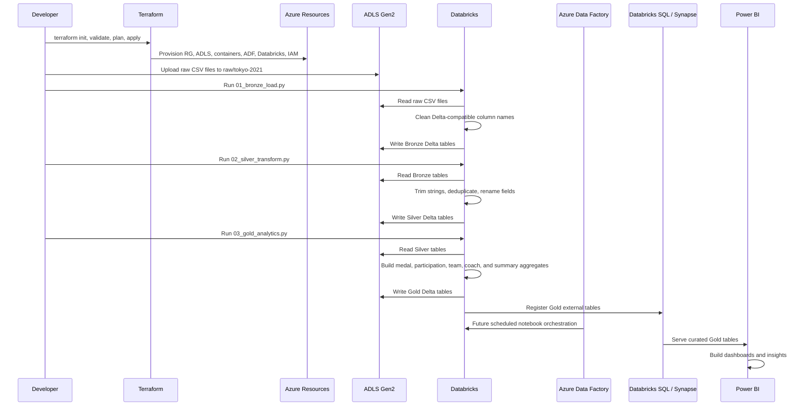
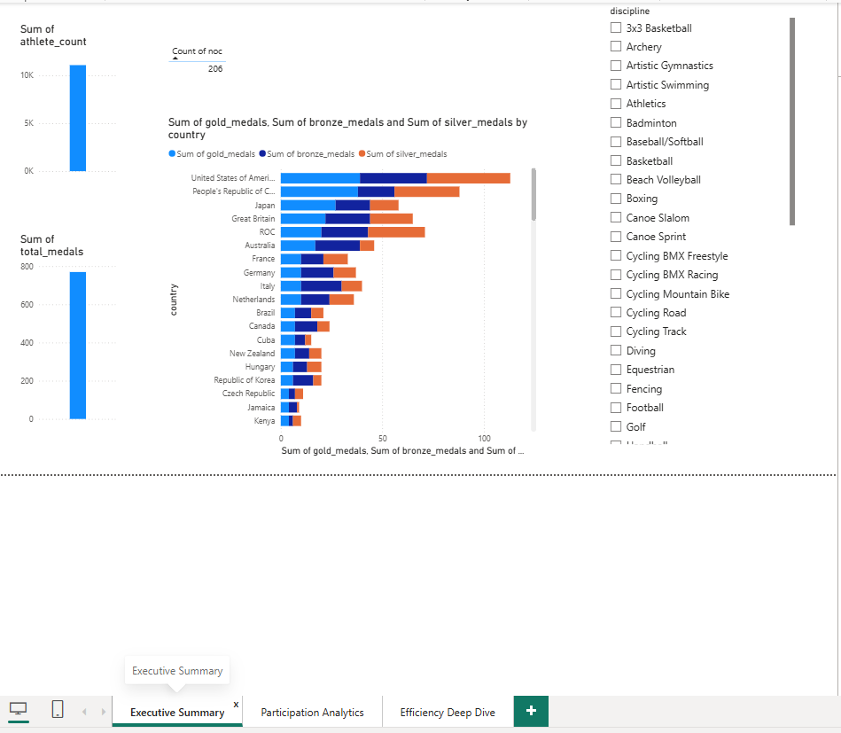
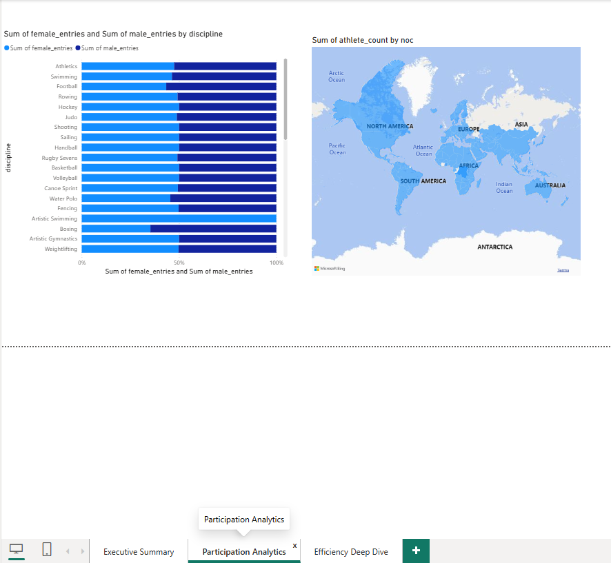
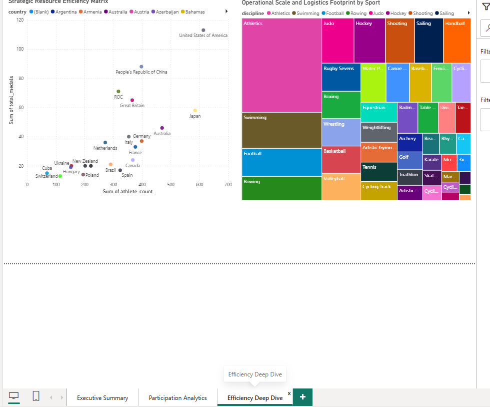

# Tokyo 2021 Olympics Azure Data Engineering Project

End-to-end data engineering project for the Tokyo 2021 Olympics dataset. The project provisions Azure infrastructure with Terraform, uploads local Kaggle CSV data into Azure Data Lake Storage Gen2, processes the data with Azure Databricks, prepares Synapse-ready analytics layers, and supports Power BI reporting.

## Project Goal

Build a cloud-native analytics platform for Tokyo Olympics data that supports:

- Medal rankings and top-performing countries
- Athlete participation by country and discipline
- Gender participation by discipline
- Team and coach distribution by country and discipline
- Data quality checks and standardized data layers
- Power BI dashboard development from curated Gold layer outputs

## Project Status

Current completed phase:

1. Project initialized locally.
2. Terraform infrastructure created.
3. Raw Tokyo Olympics files copied into `data/raw`.
4. Raw files uploaded to Azure Storage.
5. Git repository configured with remote `git@github.com:waigisteve/tokyo-2021-olympics-azure-terraform.git`.
6. Bronze ingestion completed successfully for all five source files.
7. Silver transformation completed successfully for all five Bronze tables.
8. Gold analytics logic has been implemented for business-ready aggregate tables.

GitHub repository:

```text
https://github.com/waigisteve/tokyo-2021-olympics-azure-terraform
```

## Project Journey, Challenges, and Solutions

This project was built in phases to simulate a real Azure data engineering workflow: infrastructure first, then raw data landing, then Medallion processing, and finally serving/orchestration planning.

| Phase | What happened | Challenge | Solution |
| --- | --- | --- | --- |
| Project setup | Created the local repository and organized folders for Terraform, raw data, Databricks, ADF, Synapse, Power BI, and documentation. | The GitHub repository did not initially exist online even though the local repo existed. | Confirmed the intended repo name, configured the Git remote, and documented the GitHub URL. |
| Infrastructure | Used Terraform to provision the Azure foundation: resource group, ADLS Gen2 storage, Raw/Bronze/Silver/Gold containers, Data Factory, and Databricks. | Azure resource names, especially storage accounts, must be globally unique and reusable across scripts. | Added Terraform variables and a `terraform.tfvars.example` template, with the current scripts pointing to `sttokyo2021waigi`. |
| Raw data landing | Copied the Tokyo 2021 Olympics CSV files locally and uploaded them into the ADLS Gen2 Raw container. | Local files needed to land in a predictable cloud path for repeatable Databricks processing. | Created `scripts/upload_raw_to_adls.sh` to upload `data/raw` into `raw/tokyo-2021`. |
| Bronze ingestion | Read the raw CSV files from ADLS Gen2 and wrote them as Delta outputs in the Bronze container. | Bronze initially failed on `Medals.csv` because the source column `Rank by Total` contained spaces, which Delta Lake does not allow by default. | Added a column-cleaning function to normalize column names before writing Delta tables. |
| Silver transformation | Cleaned, deduplicated, standardized, and renamed fields for analytics-friendly Silver tables. | Source datasets had inconsistent column naming and needed clearer business names. | Standardized columns, trimmed string fields, removed duplicates, and renamed fields such as `team_noc` to `country` and `total` to `total_medals`. |
| Gold analytics | Built business-ready tables for medal rankings, top medal countries, gender participation, athlete counts, team counts, coach counts, and summary metrics. | Power BI and SQL consumers need curated aggregates rather than raw or semi-cleaned datasets. | Wrote `03_gold_analytics.py` to generate dashboard-ready Delta tables in the Gold container. |
| Serving plan | Planned how analysts will query Gold data. | Gold files in ADLS are not enough by themselves for easy BI access. | Documented Gold table registration through Databricks tables and serving through Databricks SQL Warehouse or Synapse Serverless SQL. |
| Automation plan | Moved from manual notebook execution toward production orchestration. | Manual Databricks notebook runs are not production-grade. | Documented an ADF pipeline sequence for Bronze, Silver, and Gold notebook activities. |
| IaC finalization | Identified infrastructure that still needs to be codified. | Some serving and orchestration pieces may still be portal/manual work. | Documented Terraform next steps for ADF pipelines, linked services, Databricks jobs or SQL Warehouses, and explicit IAM role assignments. |

The main technical lesson from the processing phase was that cloud data engineering is not only about moving files. The raw data needed schema normalization, stable paths, secure storage access, idempotent writes, and curated Gold outputs before it was ready for dashboarding.

## Source Context

This documentation is based on:

- The local repository at `/home/waigisteve/projects/tokyo-2021-olympics-azure-terraform`
- The project README content shared in the chat
- The attached chat notes about GitHub setup, Bronze ingestion, the Bronze Delta column-name fix, successful Silver execution, and the next-step serving/orchestration roadmap
- The visible Terraform, shell, data, and Databricks files in this repository
- The requested target architecture: local Kaggle data -> ADLS Gen2 -> ADF -> Databricks -> Bronze/Silver/Gold -> Synapse/SQL serving -> Power BI

The external ChatGPT and Gemini conversation links provided in the request were not directly readable from this environment, so their private contents are not quoted here. Any details from them should be pasted into this repo or chat if they need to be incorporated verbatim.

## Architecture

```text
Local Kaggle Dataset
  -> Azure Data Lake Storage Gen2 Raw Container
  -> Azure Data Factory Orchestration
  -> Azure Databricks Transformations
  -> Bronze, Silver, and Gold Data Lake Layers
  -> Synapse Analytics / SQL Serving Layer
  -> Power BI Dashboard
```

The repository currently implements the infrastructure foundation and Databricks transformation scripts. Azure Data Factory, Synapse, and Power BI folders are present for future orchestration, serving, and reporting assets.

### Architecture Diagram

```mermaid
flowchart LR
    subgraph Local["Local Development Environment"]
        Repo["Git Repository<br/>Terraform, scripts, notebooks, docs"]
        CSV["Tokyo 2021 CSV Files<br/>data/raw"]
        TF["Terraform CLI"]
        AZCLI["Azure CLI Upload Script"]
    end

    subgraph Azure["Azure Subscription"]
        RG["Resource Group<br/>rg-tokyo2021-olympics-dataeng"]

        subgraph ADLS["ADLS Gen2 Storage Account<br/>sttokyo2021waigi"]
            Raw["raw container<br/>tokyo-2021/*.csv"]
            Bronze["bronze container<br/>Delta tables"]
            Silver["silver container<br/>Clean Delta tables"]
            Gold["gold container<br/>Business-ready Delta tables"]
        end

        ADF["Azure Data Factory<br/>Pipeline orchestration"]
        DBW["Azure Databricks Workspace"]
        UC["Unity Catalog / Hive Metastore<br/>Gold table registration"]
        DBSQL["Databricks SQL Warehouse<br/>Serving endpoint"]
        Synapse["Synapse Serverless SQL<br/>Optional serving endpoint"]
        PBI["Power BI<br/>Dashboards and reports"]
        MI["Managed Identity / Access Connector<br/>Storage Blob Data Contributor"]
    end

    Repo --> TF
    TF --> RG
    RG --> ADLS
    RG --> ADF
    RG --> DBW
    TF --> MI
    MI --> ADLS

    CSV --> AZCLI
    AZCLI --> Raw

    ADF --> DBW
    DBW --> Raw
    Raw --> Bronze
    Bronze --> Silver
    Silver --> Gold
    Gold --> UC
    UC --> DBSQL
    Gold --> Synapse
    DBSQL --> PBI
    Synapse --> PBI
```



### Workflow Diagram



## Repository Layout

```text
.
|-- README.md
|-- .gitignore
|-- adf/
|-- data/
|   `-- raw/
|       |-- Athletes.csv
|       |-- Coaches.csv
|       |-- EntriesGender.csv
|       |-- Medals.csv
|       `-- Teams.csv
|-- databricks/
|   |-- 01_bronze_load.py
|   |-- 02_silver_transform.py
|   `-- 03_gold_analytics.py
|-- docs/
|-- powerbi/
|   `-- screenshots/
|-- scripts/
|   `-- upload_raw_to_adls.sh
|-- synapse/
`-- terraform/
    |-- main.tf
    |-- providers.tf
    |-- variables.tf
    |-- outputs.tf
    `-- terraform.tfvars.example
```

## Dataset

The project uses the Tokyo 2021 Olympics Kaggle dataset stored locally in `data/raw`.

| File | Purpose |
| --- | --- |
| `Athletes.csv` | Athlete names, country/NOC, and discipline |
| `Coaches.csv` | Coach names, country/NOC, discipline, and event |
| `EntriesGender.csv` | Male/female participation counts by discipline |
| `Medals.csv` | Medal ranking and medal totals by country |
| `Teams.csv` | Team entries by country, discipline, and event |

Current raw file sizes by line count:

| File | Lines |
| --- | ---: |
| `Athletes.csv` | 11,086 |
| `Coaches.csv` | 395 |
| `EntriesGender.csv` | 47 |
| `Medals.csv` | 94 |
| `Teams.csv` | 744 |

## Azure Resources

Terraform provisions the core Azure data platform resources.

| Terraform resource | Azure resource |
| --- | --- |
| `azurerm_resource_group.rg` | Resource group |
| `azurerm_storage_account.datalake` | ADLS Gen2-enabled storage account |
| `azurerm_storage_container.raw` | Raw data container |
| `azurerm_storage_container.bronze` | Bronze Delta layer container |
| `azurerm_storage_container.silver` | Silver Delta layer container |
| `azurerm_storage_container.gold` | Gold analytics layer container |
| `azurerm_data_factory.adf` | Azure Data Factory with system-assigned identity |
| `azurerm_databricks_workspace.databricks` | Azure Databricks workspace |
| `azurerm_databricks_access_connector.uc_connector` | Databricks access connector for Unity Catalog |
| `azurerm_role_assignment.datalake_role` | Storage Blob Data Contributor assignment |
| `databricks_storage_credential.uc_creds` | Unity Catalog storage credential |
| `databricks_external_location.gold_layer` | Unity Catalog external location for Gold data |
| `databricks_grant.gold_grants` | External location permissions for account users |

## Terraform Configuration

Terraform is configured in `terraform/`.

Required providers:

- `hashicorp/azurerm`
- `databricks/databricks`

Configurable variables:

| Variable | Default / example | Description |
| --- | --- | --- |
| `location` | `eastus` | Azure region |
| `resource_group_name` | `rg-tokyo2021-olympics-dataeng` | Resource group name |
| `storage_account_name` | `sttokyo2021olympics01` in example | Globally unique ADLS Gen2 storage account name |
| `data_factory_name` | `adf-tokyo2021-olympics` | Azure Data Factory name |
| `databricks_workspace_name` | `dbw-tokyo2021-olympics` | Azure Databricks workspace name |

Terraform outputs:

- `resource_group_name`
- `storage_account_name`
- `data_factory_name`
- `databricks_workspace_url`

## Setup

Prerequisites:

- Azure subscription
- Azure CLI authenticated with `az login`
- Terraform 1.6 or later
- Access to create resource groups, storage accounts, Data Factory, Databricks, role assignments, and Unity Catalog-related resources
- Databricks account/workspace permissions for storage credentials, external locations, and grants

Create a local Terraform variables file:

```bash
cd terraform
cp terraform.tfvars.example terraform.tfvars
```

Edit `terraform.tfvars` and set a globally unique `storage_account_name`.

## Terraform Commands

Run from the `terraform/` directory:

```bash
terraform init
terraform fmt
terraform validate
terraform plan
terraform apply
```

Destroy resources when they are no longer needed:

```bash
terraform destroy
```

### Terraform Destroy Pitfall: Databricks External Location

During cleanup, Terraform may destroy Azure Data Factory, storage containers, and Databricks grants successfully, then fail when deleting the Unity Catalog external location:

```text
cannot delete external location: Cannot delete external location
because the location has ... dependent external tables.
```

This happens when Databricks external tables still reference the Gold layer external location, for example:

```text
abfss://gold@sttokyo2021waigi.dfs.core.windows.net/
```

In this state, the `databricks_external_location.gold_layer` resource is still present because Unity Catalog protects the external location while external tables depend on it. The external location itself is metadata and should not create direct compute cost, but any remaining Azure Storage account, containers, files, or other Azure resources can still incur storage or service charges.

Recommended cleanup process:

1. Run a destroy plan first and review the affected resources.

   ```bash
   terraform plan -destroy
   ```

2. If destroy fails on `databricks_external_location.gold_layer`, open Databricks SQL and find the external tables that use the Gold storage path.
3. Drop the dependent external tables.

   ```sql
   DROP TABLE IF EXISTS catalog_name.schema_name.table_name;
   ```

4. Rerun Terraform destroy.

   ```bash
   terraform destroy
   ```

For disposable lab environments, an alternative is to add `force_destroy = true` to the external location resource:

```hcl
resource "databricks_external_location" "gold_layer" {
  name            = "gold_layer_storage"
  url             = "abfss://${azurerm_storage_container.gold.name}@${azurerm_storage_account.datalake.name}.dfs.core.windows.net/"
  credential_name = databricks_storage_credential.uc_creds.name
  comment         = "External location for Unity Catalog managed Gold analytics tables"
  force_destroy   = true
}
```

Use `force_destroy` only when you are comfortable with Unity Catalog no longer managing cleanup for data under that external location. The safer default is to drop the dependent external tables first, then rerun `terraform destroy`.

## Data Upload

The upload script sends local raw CSV files to the ADLS Gen2 Raw container:

```bash
./scripts/upload_raw_to_adls.sh
```

The script currently uses:

- Resource group: `rg-tokyo2021-olympics-dataengwaigi`
- Storage account: `sttokyo2021waigi`
- Container: `raw`
- Local source: `data/raw`
- Destination prefix: `tokyo-2021`

The resulting raw ADLS paths follow this pattern:

```text
abfss://raw@<storage-account>.dfs.core.windows.net/tokyo-2021/<file>.csv
```

## Databricks Pipeline

The Databricks scripts are stored in `databricks/` and should be run in order.

### 1. Bronze Load

File: `databricks/01_bronze_load.py`

Purpose:

- Reads raw CSV files from ADLS Gen2
- Infers schemas
- Standardizes column names
- Adds metadata columns:
  - `source_file`
  - `ingestion_timestamp`
- Writes Delta tables to the Bronze container

Bronze outputs:

```text
abfss://bronze@<storage-account>.dfs.core.windows.net/tokyo-2021/athletes
abfss://bronze@<storage-account>.dfs.core.windows.net/tokyo-2021/coaches
abfss://bronze@<storage-account>.dfs.core.windows.net/tokyo-2021/entries_gender
abfss://bronze@<storage-account>.dfs.core.windows.net/tokyo-2021/medals
abfss://bronze@<storage-account>.dfs.core.windows.net/tokyo-2021/teams
```

The Bronze script includes column-name cleanup because Delta Lake does not allow some special characters in column names by default. This fixed the original Bronze failure on `Medals.csv`, where the source column `Rank by Total` caused a Delta write error.

### 2. Silver Transform

File: `databricks/02_silver_transform.py`

Purpose:

- Reads Bronze Delta data
- Standardizes column names
- Trims string columns
- Removes duplicate records
- Adds `load_timestamp`
- Renames key analytics fields for clarity

Silver execution completed successfully for:

```text
silver/tokyo-2021/athletes
silver/tokyo-2021/coaches
silver/tokyo-2021/entries_gender
silver/tokyo-2021/medals
silver/tokyo-2021/teams
```

Important Silver renames:

| Dataset | Rename |
| --- | --- |
| `entries_gender` | `female` -> `female_entries` |
| `entries_gender` | `male` -> `male_entries` |
| `entries_gender` | `total` -> `total_entries` |
| `medals` | `team_noc` -> `country` |
| `medals` | `gold` -> `gold_medals` |
| `medals` | `silver` -> `silver_medals` |
| `medals` | `bronze` -> `bronze_medals` |
| `medals` | `total` -> `total_medals` |

### 3. Gold Analytics

File: `databricks/03_gold_analytics.py`

Purpose:

- Reads Silver Delta data
- Builds analytics-ready Gold tables
- Writes Delta outputs for dashboarding and SQL serving

Gold outputs:

| Gold table | Purpose |
| --- | --- |
| `medal_rankings` | Country medal ranking ordered by official rank |
| `top_medal_countries` | Top 20 countries by total and gold medals |
| `gender_participation_by_discipline` | Female/male participation counts and percentages |
| `athlete_count_by_country` | Distinct athlete counts by NOC |
| `athlete_count_by_discipline` | Distinct athlete counts by discipline |
| `team_count_by_discipline_country` | Team counts by discipline and NOC |
| `coach_count_by_country_discipline` | Coach counts by NOC and discipline |
| `summary_metrics` | Total athletes, countries, disciplines, coaches, teams, and medals |

Gold paths follow this pattern:

```text
abfss://gold@<storage-account>.dfs.core.windows.net/tokyo-2021/<gold-table>
```

## Databricks Notebook Run Notes

When running these scripts manually in Databricks notebooks, add storage access configuration before the script body if the workspace is not already configured with managed identity, Unity Catalog external locations, or another approved credential method.

Example key-based block used during development:

```python
storage_account = "sttokyo2021waigi"
storage_account_key = "PASTE_YOUR_STORAGE_ACCOUNT_KEY_HERE"

spark.conf.set(
    f"fs.azure.account.key.{storage_account}.dfs.core.windows.net",
    storage_account_key,
)
```

Do not commit real storage keys, secrets, or Databricks tokens to the repository.

## Gold Table Registration

The Gold Delta files should be registered as queryable tables before connecting BI tools. This can be done through Unity Catalog or the Hive metastore.

Example SQL:

```sql
CREATE DATABASE IF NOT EXISTS gold_olympics;

CREATE TABLE IF NOT EXISTS gold_olympics.medal_rankings
USING DELTA
LOCATION 'abfss://gold@sttokyo2021waigi.dfs.core.windows.net/tokyo-2021/medal_rankings';

CREATE TABLE IF NOT EXISTS gold_olympics.top_medal_countries
USING DELTA
LOCATION 'abfss://gold@sttokyo2021waigi.dfs.core.windows.net/tokyo-2021/top_medal_countries';

CREATE TABLE IF NOT EXISTS gold_olympics.gender_participation_by_discipline
USING DELTA
LOCATION 'abfss://gold@sttokyo2021waigi.dfs.core.windows.net/tokyo-2021/gender_participation_by_discipline';

CREATE TABLE IF NOT EXISTS gold_olympics.athlete_count_by_country
USING DELTA
LOCATION 'abfss://gold@sttokyo2021waigi.dfs.core.windows.net/tokyo-2021/athlete_count_by_country';

CREATE TABLE IF NOT EXISTS gold_olympics.athlete_count_by_discipline
USING DELTA
LOCATION 'abfss://gold@sttokyo2021waigi.dfs.core.windows.net/tokyo-2021/athlete_count_by_discipline';

CREATE TABLE IF NOT EXISTS gold_olympics.team_count_by_discipline_country
USING DELTA
LOCATION 'abfss://gold@sttokyo2021waigi.dfs.core.windows.net/tokyo-2021/team_count_by_discipline_country';

CREATE TABLE IF NOT EXISTS gold_olympics.coach_count_by_country_discipline
USING DELTA
LOCATION 'abfss://gold@sttokyo2021waigi.dfs.core.windows.net/tokyo-2021/coach_count_by_country_discipline';

CREATE TABLE IF NOT EXISTS gold_olympics.summary_metrics
USING DELTA
LOCATION 'abfss://gold@sttokyo2021waigi.dfs.core.windows.net/tokyo-2021/summary_metrics';
```

## Suggested Data Factory Orchestration

The `adf/` folder is available for future ADF assets. The current Databricks processing was run manually, so the next production step is to automate the notebook sequence with Azure Data Factory.

A recommended pipeline is:

1. Validate raw files exist in the `raw/tokyo-2021` ADLS prefix.
2. Trigger `01_bronze_load.py` as a Databricks notebook activity.
3. Trigger `02_silver_transform.py` after Bronze succeeds.
4. Trigger `03_gold_analytics.py` after Silver succeeds.
5. Add success/failure notifications or logging.

Terraform resource to add for IaC-managed orchestration:

```text
azurerm_data_factory_pipeline
```

The pipeline should use a Databricks Notebook Activity and either an existing interactive cluster, a job cluster, or a linked Databricks service configured in ADF.

## Synapse / SQL Serving Layer

The `synapse/` folder is reserved for SQL serving assets. Gold data can be served in two practical ways.

Option A: Synapse Serverless SQL Pool

- Query the Gold ADLS container directly with `OPENROWSET` or external tables.
- Serve data through standard T-SQL without keeping a Databricks cluster running.
- Good fit for a traditional Azure data engineering stack.

Option B: Databricks SQL Warehouse

- Register the Gold Delta paths as Databricks tables.
- Query the registered Gold tables through a Databricks SQL Warehouse.
- Good fit if the serving layer should stay close to Databricks and Delta Lake.

For this project, Databricks SQL Warehouse is the simplest serving path because the transformations already produce Delta data in Databricks and the Gold tables can be registered directly. Synapse Serverless remains a strong option if the goal is to demonstrate a broader Azure serving stack.

## Power BI Reporting

The `powerbi/` folder is reserved for report assets and screenshots.

Power BI can connect through:

- Azure Databricks, when using a Databricks SQL Warehouse.
- Azure Synapse Analytics, when serving through Synapse Serverless SQL.

Recommended connection mode:

- Use Import for a small portfolio/demo dataset.
- Use DirectQuery if the project goal is to demonstrate live serving behavior.

Recommended dashboard pages:

- Medal leaderboard
- Country performance overview
- Athlete participation by country
- Athlete participation by discipline
- Gender participation by discipline
- Coach and team distribution
- Summary metrics page

Recommended Power BI source:

- Gold Delta tables through Databricks SQL, Synapse serverless SQL, or another SQL serving layer.

Recommended dashboard measures and visuals:

- Medal count by country
- Gold, silver, and bronze medal breakdown
- Top medal countries
- Medal count compared with athlete count
- Gender distribution by discipline
- Athlete participation by discipline
- Coach and team distribution by country

### Power BI Dashboard Screenshots

The Power BI report contains three pages that turn the Gold analytics layer into business-facing views.

#### Executive Summary



This page provides the top-level executive view. It highlights total athlete count, NOC count, total medals, medal breakdown by country, and a discipline slicer for interactive filtering.

#### Participation Analytics



This page focuses on participation patterns. It compares female and male entries by discipline and maps athlete count by NOC to show geographic participation coverage.

#### Efficiency Deep Dive



This page explores performance efficiency and operational scale. It compares athlete count against total medals by country and uses a treemap to show the sport footprint by discipline.

## Terraform Finalization

The final IaC goal is to make the Azure environment reproducible without manual portal configuration.

Recommended additions:

- Add ADF pipeline resources with `azurerm_data_factory_pipeline`.
- Add ADF linked services for Azure Databricks and ADLS Gen2.
- Manage Databricks clusters, jobs, or SQL Warehouses through the Databricks provider where supported.
- Keep Storage Blob Data Contributor role assignments explicit with `azurerm_role_assignment`.
- Prefer managed identities, Unity Catalog storage credentials, or external locations over hardcoded storage keys.
- Parameterize storage account names in scripts and notebooks so they match Terraform outputs.

## Data Layer Definitions

| Layer | Description |
| --- | --- |
| Raw | Original Kaggle CSV files uploaded to ADLS Gen2 |
| Bronze | Raw files converted to Delta with cleaned column names and ingestion metadata |
| Silver | Cleaned, deduplicated, standardized Delta tables |
| Gold | Aggregated and dashboard-ready analytics tables |

## Current Implementation Notes

- Local Terraform variable files, state files, provider plugins, and secrets are excluded from version control.
- `terraform.tfvars.example` is committed as the safe template for local configuration.
- `scripts/upload_raw_to_adls.sh` and the Databricks scripts currently contain the concrete storage account name `sttokyo2021waigi`.
- If Terraform is used to create a different storage account, update the upload script and Databricks scripts or parameterize them.
- The repository includes local raw CSV files under `data/raw`.
- The project currently has directories for `adf/`, `synapse/`, and `powerbi/`, but no committed orchestration, SQL, or report artifacts yet.
- The Bronze script originally needed a fix for Delta-compatible column names after `Medals.csv` failed on `Rank by Total`.

## Git Ignore Policy

The `.gitignore` excludes:

- Terraform state and variable files
- Terraform provider/plugin directories
- Python virtual environments and bytecode
- Local Bronze/Silver/Gold data outputs
- Secret files such as `.env`, `.pem`, and `.key`
- Editor metadata

## Recommended Next Steps

1. Parameterize the storage account name in the upload script and Databricks scripts.
2. Add ADF pipeline JSON or deployment documentation under `adf/`.
3. Add Synapse or Databricks SQL scripts for Gold table serving.
4. Add Power BI report screenshots and model documentation under `powerbi/`.
5. Add data quality checks for schema validation, null checks, duplicate checks, and medal total consistency.
6. Add a troubleshooting section after the first full successful deployment and pipeline run.

## Troubleshooting

### Bronze Fails On `Rank by Total`

Cause:

Delta Lake does not allow spaces and some special characters in column names by default.

Fix:

- Clean column names before writing Delta.
- Convert names to lowercase.
- Replace spaces, slashes, and hyphens with underscores.
- Remove parentheses and periods.

Example:

```text
Rank by Total -> rank_by_total
```

### Partial Bronze Output Exists

If Bronze loads some files and fails before completion, rerun the corrected Bronze script. The script writes with `mode("overwrite")`, so a successful rerun replaces partial outputs.

### Storage Access Fails In Databricks

Check one of the following access paths:

- Workspace managed identity has Storage Blob Data Contributor on the storage account.
- Unity Catalog storage credential and external location are configured.
- A temporary notebook-only storage key block is present and uses the correct storage account.

Do not store real keys in committed notebooks or scripts.
